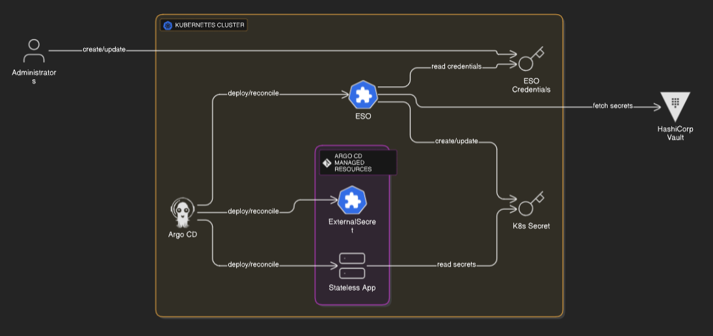

# Demo of External Secret Operator and ArgoCD

# Table of Contents
- [Demo of External Secret Operator and ArgoCD](#demo-of-external-secret-operator-and-argocd)
- [Table of Contents](#table-of-contents)
- [Description](#description)
- [Technical Environnement](#technical-environnement)
    - [System Requirements](#system-requirements)
  - [Stack Deployment](#stack-deployment)
  - [Install External Secrets Operator (ESO)](#install-external-secrets-operator-eso)
  - [Install ArgoCD](#install-argocd)
- [Scenario #1: Using a Kubernetes Secret as the backend (for demo purposes)](#scenario-1-using-a-kubernetes-secret-as-the-backend-for-demo-purposes)
  - [Structure of demo-app folder](#structure-of-demo-app-folder)
  - [Configuration](#configuration)
      - [Create a Kubernetes Secret:](#create-a-kubernetes-secret)
      - [Define a SecretStore that points to the Kubernetes backend:](#define-a-secretstore-that-points-to-the-kubernetes-backend)
        - [Create Service Account](#create-service-account)
      - [Finally, create an ExternalSecret Resource](#finally-create-an-externalsecret-resource)
- [Scenario #2: HashiCorp Vault as Backend](#scenario-2-hashicorp-vault-as-backend)
  - [Structure of demo-app-hcp folder](#structure-of-demo-app-hcp-folder)
  - [Configuration](#configuration-1)
    - [Run HashiCorp Vault in Dev Mode on Kubernetes](#run-hashicorp-vault-in-dev-mode-on-kubernetes)
      - [Deploy HashiCorp Vault](#deploy-hashicorp-vault)
      - [Expose Vault Service](#expose-vault-service)
      - [Port-forward to get access to Vault UI:](#port-forward-to-get-access-to-vault-ui)
      - [Create a simple secret in the vault](#create-a-simple-secret-in-the-vault)
    - [Create a Kubernetes Secret for the Vault Token](#create-a-kubernetes-secret-for-the-vault-token)
    - [Create a SecretStore Resource for Vault](#create-a-secretstore-resource-for-vault)
    - [Create an ExternalSecret Resource](#create-an-externalsecret-resource)
    - [Summary](#summary)
- [Scenario #3: Delinea DSV as Backend (not tested)](#scenario-3-delinea-dsv-as-backend-not-tested)


# Description
This project demonstrates secure, GitOps-driven secret management for Kubernetes applications using External Secrets Operator (ESO) and Argo CD. Instead of storing sensitive values directly in Kubernetes manifests or Git repositories, secrets are managed in an external secrets manager such as HashiCorp Vault, AWS Secrets Manager, or Delinea DSV. The ESO automatically syncs these secrets into Kubernetes as standard Secret resources, which are then consumed by the application. This approach enables secure secret rotation, centralized auditability, and separation of secret management from application deployment. Argo CD continuously deploys and reconciles all resources, including ESO custom resources, ensuring that applications always receive up-to-date secret values without exposing sensitive data in version control or CI/CD pipelines.



# Technical Environnement
The table below shows the tools and solutions used in the project:

| Item    | Technology/ Tool | Version |
| -------- | ------- | ------- |
| VCS           | GitHub | N/A|
| Container Deployment | MiniKube |  1.34.0 |

### System Requirements
* Recommended system requirements: 1GB RAM, x86 or arm64 CPU
* Minimum system requirements: 512MB RAM + swap

## Stack Deployment
The application stack can be run using:
1. Docker
2. Using Kubernetes (Minikube)

## Install External Secrets Operator (ESO)

Install ESO in cluster via Helm:

```bash
helm repo add external-secrets https://charts.external-secrets.io
helm repo update
helm install external-secrets external-secrets/external-secrets -n external-secrets --create-namespace
```

## Install ArgoCD

Install via Helm:

```bash
helm repo add argo https://argoproj.github.io/argo-helm
helm repo update
```

Create the namespace:

```bash
kubectl create namespace argocd
```
Install ArgoCD:

```bash
helm install argocd argo/argo-cd -n argocd
```

To access the ArgoCD web UI locally:

```bash
kubectl port-forward svc/argocd-server -n argocd 8080:443
```


-> Username: admin

-> Password: 
Retrieve with:

```bash
kubectl get secret argocd-initial-admin-secret -n argocd -o jsonpath="{.data.password}" | base64 -d
```

# Scenario #1: Using a Kubernetes Secret as the backend (for demo purposes)
This workflow enables secure, automated secret management for ArgoCD-managed apps using External Secrets Operator and Kubernetes Secrets as backend.

## Structure of demo-app folder
```bash
demo-app/
├── demo-app-deployment.yaml
├── demo-app-service.yaml
├── demo-eso-store-role.yaml
├── demo-external-secret.yaml
├── demo-secret-store.yaml
└── demo-secret.yaml
```
## Configuration

#### Create a Kubernetes Secret:
This secret is used for connecting to backend.
```yaml
apiVersion: v1
kind: Secret
metadata:
  name: demo-secret
  namespace: ns-demo
type: Opaque
stringData:
  SECRET_VALUE: "demo-secret-value"
```
Apply it:
```bash
kubectl apply -f demo-secret.yaml
```


#### Define a SecretStore that points to the Kubernetes backend:
We are using the Kubernetes provider and want to reference secrets in the same cluster (for demo), we can explicitly set auth to use the default/demo service account and provide the CA bundle from the service account.
##### Create Service Account

```bash
kubectl create serviceaccount demo-store -n ns-demo
```

Then, set `auth` in secret store to use the service account.
`caProvider` points to the default Kubernetes root CA, which is typically stored in the `kube-root-ca.crt` ConfigMap in each namespace.

```yaml
apiVersion: external-secrets.io/v1
kind: SecretStore
metadata:
  name: local-secret-store
  namespace: ns-demo
spec:
  provider:
    kubernetes:
      remoteNamespace: ns-demo
      auth:
        serviceAccount:
          name: demo-store
      server:
        caProvider:
          type: ConfigMap
          name: kube-root-ca.crt
          key: ca.crt
```

The ServiceAccount referenced in `SecretStore` must have permission to read (get/list/watch) secrets in the target namespace.
Thus, create a Role that allows reading secrets and creating `SelfSubjectRulesReview` in the namespace.

```yaml
apiVersion: rbac.authorization.k8s.io/v1
kind: Role
metadata:
  name: demo-eso-store-role
  namespace: ns-demo
rules:
- apiGroups: [ "" ]
  resources: [ "secrets" ]
  verbs: [ "get", "list", "watch" ]
---
apiVersion: rbac.authorization.k8s.io/v1
kind: RoleBinding
metadata:
  name: demo-eso-store-rolebinding
  namespace: ns-demo
subjects:
- kind: ServiceAccount
  name: demo-store
  namespace: ns-demo
roleRef:
  kind: Role
  name: demo-eso-store-role
  apiGroup: rbac.authorization.k8s.io
```


#### Finally, create an ExternalSecret Resource

```yaml
apiVersion: external-secrets.io/v1
kind: ExternalSecret
metadata:
  name: demo-external-secret
  namespace: ns-demo
spec:
  refreshInterval: 2m
  secretStoreRef:
    name: local-secret-store
    kind: SecretStore
  target:
    name: demo-external-secret
    creationPolicy: Owner
  data:
  - secretKey: SECRET_VALUE
    remoteRef:
      key: demo-secret
      property: SECRET_VALUE
```


# Scenario #2: HashiCorp Vault as Backend
In this scenario, we use HashiCorp Vault in dev mode on Kubernetes and configuring External Secrets Operator (ESO) to use Vault as a backend for secret management.

## Structure of demo-app-hcp folder
```bash
demo-app-hcp/
├── demo-app-deployment.yaml
├── demo-app-service.yaml
├── demo-external-secret.yaml
├── demo-secret-store.yaml
└── demo-secret.yaml
```
## Configuration
### Run HashiCorp Vault in Dev Mode on Kubernetes

#### Deploy HashiCorp Vault
```yaml
apiVersion: v1
kind: Pod
metadata:
  name: vault-dev
  namespace: hcp-vault
  labels:
    app: vault
spec:
  containers:
  - name: vault
    image: hashicorp/vault:1.16.1
    args:
    - "server"
    - "-dev"
    ports:
    - containerPort: 8200
    env:
    - name: VAULT_DEV_ROOT_TOKEN_ID
      value: "root"
```
Apply it:
```bash
kubectl apply -f dep-hcp-vault.yaml
```

#### Expose Vault Service
```yaml
apiVersion: v1
kind: Service
metadata:
  name: vault-dev
  namespace: hcp-vault
spec:
  type: ClusterIP
  ports:
  - port: 8200
    targetPort: 8200
  selector:
    app: vault
```

Apply it:
```bash
kubectl apply -f hcp-vault-service.yaml
```

#### Port-forward to get access to Vault UI:
```bash
kubectl port-forward pod/vault-dev 8200:8200
```
and the UI is avaialble on: `http://localhost:8200` (token: root).

#### Create a simple secret in the vault
Create a secret that will be used by the Kubernetes application:
```bash
export VAULT_ADDR='http://localhost:8200'
export VAULT_TOKEN='root'
vault kv put secret/hello-world SECRET_VALUE="hello-from-vault"
```

### Create a Kubernetes Secret for the Vault Token
```yaml
apiVersion: v1
kind: Secret
metadata:
  name: vault-token
  namespace: ns-demo-hcp
type: Opaque
stringData:
  token: "root"
```
Apply it:

```bash
kubectl apply -f demo-secret.yaml
```

### Create a SecretStore Resource for Vault
```yaml
apiVersion: external-secrets.io/v1
kind: SecretStore
metadata:
  name: vault-backend
  namespace: ns-demo-hcp
spec:
  provider:
    vault:
      server: "http://vault-dev.hcp-vault.svc.cluster.local:8200"
      path: "secret"
      version: "v2"
      auth:
        tokenSecretRef:
          name: vault-token
          key: token
```
### Create an ExternalSecret Resource
Finally create the ESO to retrieve the secret from the backend.

```yaml
apiVersion: external-secrets.io/v1
kind: ExternalSecret
metadata:
  name: demo-external-secret
  namespace: ns-demo-hcp
spec:
  refreshInterval: 2m
  secretStoreRef:
    name: vault-backend
    kind: SecretStore
  data:
  - secretKey: SECRET_VALUE
    remoteRef:
      key: hello-world
      property: SECRET_VALUE
```
### Summary

| Resource 	| Name	| Purpose |
| ----------|-------|---------|
|Pod/Service|vault-dev | Runs Vault in dev mode |
| Secret |	vault-token	| Stores Vault root token for ESO|
| SecretStore |	vault-backend | Configures ESO to use Vault as backend |
| ExternalSecret | hello-world-secret |	Syncs Vault secret into Kubernetes |

# Scenario #3: Delinea DSV as Backend (not tested)
In this scenario, Delinea is used as the backend. The configuration steps are the same as in the previous scenario, with only a slight difference in the ESO file.

First, we need to create `dsv-client-secret` Kubernetes secret in advance with a DSV client credentials, and store it in a Kubernetes Secret.

Then, create SecretStore for Delinea DSV

```yaml
apiVersion: external-secrets.io/v1
kind: SecretStore
metadata:
  name: delinea-dsv-store
  namespace: ns-demo-dsv
spec:
  provider:
    delinea:
      tenant: "<DELINEA_TENANT>"
      clientId: "<CLIENT_ID>"
      clientSecret:
        name: dsv-client-secret
        key: client-secret
```
and finally, ExternalSecret to fetch a secret from DSV:

```yaml
apiVersion: external-secrets.io/v1
kind: ExternalSecret
metadata:
  name: demo-external-secret
  namespace: ns-demo-dsv
spec:
  refreshInterval: "1h"
  secretStoreRef:
    name: delinea-dsv-store
    kind: SecretStore
  target:
    name: demo-app-dsv
  data:
    - secretKey: password
      remoteRef:
        key: /path/to/secret/in/dsv
        property: password
```